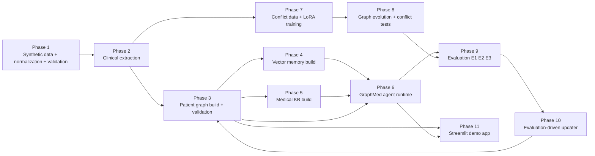
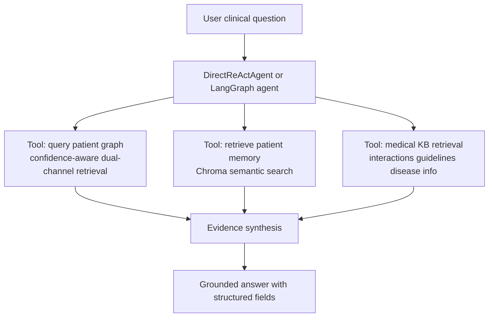
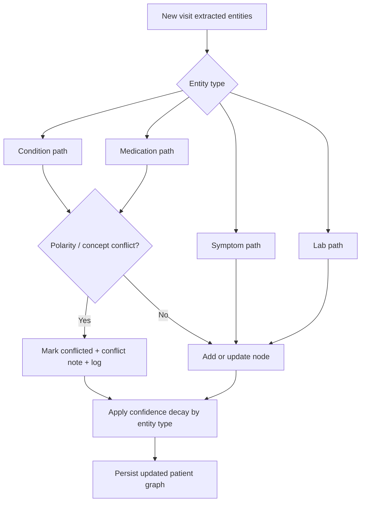
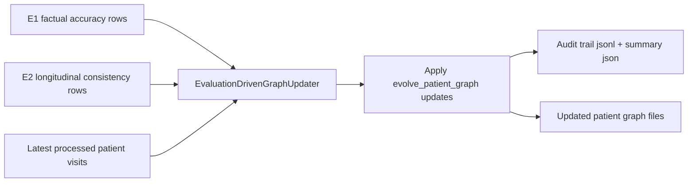

# GraphMed Project Audit and Presentation Guide

## 1. Purpose of this document

This document is a presentation-ready, audit-style explanation of GraphMed so you can handle cross-questions confidently.

It is written from code and artifact audit of this repository, not only conceptual claims.

## 2. One-line project story

GraphMed is a longitudinal clinical reasoning system that combines:

1. Structured temporal patient knowledge graphs.
2. Visit-level vector memory.
3. External medical knowledge base retrieval.
4. Agentic reasoning and conflict detection.
5. Evaluation-driven graph updates.

The core value proposition is better continuity across visits, especially for trend tracking and contradiction detection.

## 3. Problem statement and motivation

Typical single-shot medical QA systems have three important limitations:

1. No persistent patient memory across visits.
2. Weak temporal reasoning over changing labs/medications/symptoms.
3. Poor contradiction handling (for example, "no anticoagulants" vs "currently taking warfarin").

GraphMed addresses this using a dual-memory strategy and an explicit graph evolution loop.

## 4. Audited system architecture

### 4.1 End-to-end phase map

### 4.2 Runtime reasoning architecture

### 4.3 Graph evolution and conflict handling

### 4.4 Evaluation to update feedback loop

## 5. Phase-by-phase audit

## Phase 1: Data generation, normalization, validation

Goal:
Create synthetic longitudinal patient data and normalize schema for downstream consistency.

Key outputs:

1. Patient JSON files under data/patients.
2. Normalization report under data/reports.

Important implementation detail:
Blood pressure fields are normalized into explicit BP_systolic and BP_diastolic style keys.

Why this matters for questions:
Prevents early schema drift that propagates to extraction, graph construction, and evaluation.

## Phase 2: Clinical NLP extraction

Goal:
Convert visit notes to structured entities and relations.

Audited behavior from extraction module:

1. Hybrid extraction approach: regex/rule patterns with optional LLM enrichment.
2. Canonicalization maps for conditions, symptoms, lab aliases.
3. Medication-dosage splitting and normalized lists.
4. LLM JSON parsing is defensive (fence removal, substring recovery).
5. Relationship schema is constrained through allowed semantic pairs.

Typical extracted fields:

1. conditions
2. medications
3. dosages
4. symptoms
5. lab_values
6. procedures
7. relationships

Cross-question angle:
If asked "why not pure LLM extraction?", answer with speed, determinism, and reduced parse fragility from structured rules.

## Phase 3: Temporal patient graph construction

Goal:
Build one evolving knowledge graph per patient.

Audited design in graph module:

1. Graph type: NetworkX MultiDiGraph.
2. Root patient node linked to entity nodes.
3. Stable entity node IDs per patient and entity type.
4. Timestamped facts with last_confirmed and confidence.
5. Type-specific confidence decay rates and minimum floors.
6. Special handling: chronic and allergy-like facts decay slower and keep higher floors.

Retrieval innovation audited:

1. Hybrid score = semantic overlap + confidence + recency + source reliability.
2. Dual channel retrieval:
   - current_likely_state
   - critical_historical_facts
3. Separate conflict candidates returned for safety-focused reasoning.

Why this matters:
It avoids forgetting clinically critical old facts while still favoring recent context.

## Phase 4: Vector memory for visit context

Goal:
Store narrative visit summaries for semantic recall.

Audited behavior:

1. Chroma persistent collections per patient.
2. Sentence-transformer embeddings (all-MiniLM-L6-v2).
3. Visit summary includes not only clinical facts but narrative signals:
   - emotion terms
   - uncertainty terms
   - clinician intent terms
4. Upsert semantics improve idempotency for rebuilds.
5. Telemetry-noise suppression for known Chroma/PostHog friction.

Cross-question angle:
"Why both graph and vector DB?" Graph captures structured truth candidates; vectors capture narrative context and soft cues not modeled as graph edges.

## Phase 5: External medical knowledge base

Goal:
Ground answers in external non-patient medical evidence.

Audited ingestion strategy:

1. Source priority order:
   - DrugBank
   - CDC guidelines
   - PubMed
   - MedlinePlus
2. Chunking with overlap.
3. Metadata includes source_priority, type, evidence info.
4. Weighted retrieval respects source quality and document type intent.

Key value:
Supports interaction checks, disease/medication info, and guideline-backed responses.

## Phase 6: Agent runtime

Goal:
Provide grounded clinical QA over patient + external context.

Two agent paths exist:

1. LangGraph-based stateful agent.
2. Direct ReAct agent (API-first, fewer dependencies).

Audited tooling includes:

1. Query patient graph.
2. Retrieve patient memory.
3. Query medical KB.
4. Drug interaction check.
5. Disease and medication info retrieval.
6. Lab reference and guideline retrieval.

Provider flexibility:
Groq/OpenRouter/Google paths with environment-based routing and selective fallback.

Cross-question angle:
"What if provider fails or rate limits?" Retry plus fallback logic exists in evaluation/runtime paths.

## Phase 7: Conflict classifier data + LoRA training

Goal:
Train contradiction detector for clinical statement pairs.

Audited runtime routing:

1. Prefer LoRA conflict model.
2. Fallback to simple model if LoRA unavailable.
3. Fallback to rule-based logic if runtime load fails.

Why this matters:
Graceful degradation keeps pipeline running even when model or torch runtime is unstable.

## Phase 8: Graph evolution and conflict resolution

Goal:
Apply new-visit updates safely with conflict awareness.

Audited behavior:

1. Processes conditions, medications, symptoms, labs.
2. Polarity-aware conflict detection (affirmed vs negated statements).
3. Marks conflicting entities with status and notes.
4. Uses newest data precedence where appropriate.
5. Logs operations (ADD, UPDATE, CONFLICT) for traceability.
6. Applies post-update confidence decay.

Cross-question angle:
"Do you delete old facts?" No, facts are retained with conflict/supersession semantics and changing confidence.

## Phase 9: Evaluation framework

Goal:
Compare GraphMed with baseline over three experiments.

Audited experiment definitions:

1. E1 factual accuracy (50 QA pairs).
2. E2 longitudinal consistency (10 patients x 5 questions = 50 cases).
3. E3 contradiction detection (30 synthetic contradictions).

Audited baselines:

1. Simple baseline RAG for E1/E2.
2. No-classifier baseline for E3.
3. Optional LLM prompt-only conflict baseline for E3.

Audit caution:
There are multiple evaluation artifacts across runs; some files show different metric values from different timestamps.
For presentation, always state the specific file and run date you are citing.

## Phase 10: Evaluation-driven updater

Goal:
Close the loop by using evaluation outcomes to trigger graph updates.

Audited triggers include:

1. Low patient-level factscore.
2. Low patient-level consistency.
3. Underperforming baseline by margin.
4. New visit date not reflected in graph timeline.

Auditability features:

1. JSONL event log for each applied update.
2. Summary JSON with run ID, counts, and circumstances.

## Phase 11: Streamlit demo app

Goal:
Interactive demonstration of graph state, evolution, and QA.

Audited capabilities:

1. Patient selection.
2. Graph visualization (PyVis).
3. Chat interface with reasoning/tool traces.
4. Manual new-visit simulation and graph evolution.
5. Vector memory update integration.

## 6. Data contracts and persistence layout

Primary data stores:

1. data/patients and data/patients_processed.
2. data/graphs for per-patient graph JSON files.
3. data/chroma_db for patient visit memory.
4. data/medical_kb for external knowledge embeddings.
5. data/baseline_chroma for baseline retriever index.
6. evaluation/results/phase9 for experiment artifacts.

Graph file concept:

1. nodes with type, confidence, timestamps, status.
2. edges with relation and established date.

This separation supports reproducibility and independent phase reruns.

## 7. What is technically novel in GraphMed

Strong talking points:

1. Dual memory design (structured graph + narrative vector memory).
2. Confidence as freshness/trust signal with typed decay policies.
3. Dual-channel graph retrieval that protects critical old facts.
4. Integrated contradiction pipeline (LoRA first, deterministic fallbacks).
5. Evaluation-driven automatic graph update loop (Phase 10).

## 8. Measured results to quote carefully

Important: the repository contains artifacts from different runs.
Use one run consistently during presentation.

If you use the current phase9_summary.json snapshot:

1. E1 overall factscore mean: GraphMed 0.5533 vs Baseline 0.6533.
2. E1 multi-visit factscore mean: GraphMed 0.6333 vs Baseline 0.5000.
3. E3 conflict detection: GraphMed precision/recall/F1 = 1.0/1.0/1.0.
4. Evaluation-driven updates were applied to multiple patients with audit logs.

If asked why E1 overall can be lower while multi-visit is higher:

1. GraphMed emphasizes longitudinal consistency and safety context.
2. Baseline may score higher on short direct fact prompts in some runs.
3. GraphMed performs better on cross-visit memory-sensitive prompts.

## 9. Known limitations and honest audit notes

You should proactively mention these to build credibility:

1. Metric variability across runs/providers and prompt settings.
2. Some runtime environments can hit torch DLL issues on Windows, triggering fallback conflict modes.
3. LLM provider availability/rate-limit can affect latency and output style.
4. Some normalized answer artifacts show formatting brittleness; manual review files are included for audit.

## 10. Likely cross-questions and strong answers

Q1. Why not use only RAG without graphs?
Answer:
RAG retrieves text similarity, but temporal state and conflict semantics are weak. GraphMed encodes persistent entities and relationships, so it can reason over evolution (what changed, what conflicts, what remains critical).

Q2. How is hallucination reduced?
Answer:
By grounding through three sources: patient graph, patient memory, and external medical KB. Agent tools are constrained, and evaluation includes factual and consistency scoring.

Q3. How do you handle contradictions?
Answer:
Contradictions are detected via LoRA classifier with fallbacks. Evolution marks entities as CONFLICTED with notes instead of silently overwriting history.

Q4. Is confidence a truth probability?
Answer:
No. In this system confidence is freshness/trust signal. It decays over time differently by entity type and has safety floors for critical facts.

Q5. What happens when model or API fails?
Answer:
The system uses fallback logic (provider routing, heuristic conflict detector, JSON-based QA fallback in evaluation) to preserve execution continuity.

Q6. How is reproducibility handled?
Answer:
Each phase persists artifacts to deterministic directories. Evaluation writes JSON/CSV outputs plus manual review subsets and updater audit logs.

Q7. Why does baseline sometimes beat GraphMed in some metrics?
Answer:
Because benchmarks mix question types. GraphMed is optimized for longitudinal and safety-aware reasoning, not only short direct retrieval. Multi-visit and conflict results better reflect its design goals.

Q8. Is this clinically deployable today?
Answer:
No. It is a research/prototype system for decision support experimentation, not a certified clinical device.

Q9. What is the main contribution beyond standard pipelines?
Answer:
The closed-loop architecture: temporal graph + dual memory + contradiction pipeline + evaluation-driven self-updating graph.

Q10. How can you improve next?
Answer:

1. Calibrated confidence with uncertainty estimation.
2. Better contradiction datasets from real de-identified records.
3. Stronger temporal graph retrieval benchmarks.
4. Human-in-the-loop review before auto-update in production-like workflows.

## 11. Suggested demo flow for presentation day (8-12 minutes)

1. Start with problem statement: memoryless clinical QA limitations.
2. Show architecture diagram and dual-memory concept.
3. Walk one patient trajectory across 3-4 visits.
4. Ask a conflict-risk question (drug safety or contradiction pair).
5. Show graph update and conflict flagging.
6. Show one evaluation table summary and explain tradeoff.
7. End with limitations + roadmap.

## 12. 90-second backup pitch

GraphMed is a longitudinal clinical reasoning framework that treats patient history as an evolving knowledge graph, not just static text. Each visit is extracted into structured entities, stored in a temporal graph, and paired with semantic memory in a vector store. At query time, an agent retrieves from graph plus memory plus external medical knowledge to produce grounded answers. A dedicated contradiction module flags conflicting statements, and evaluation results can automatically trigger graph updates with full audit logs. The key strength is continuity over time, especially for multi-visit reasoning and safety conflict detection.

## 13. Final checklist before presenting

1. Re-run the exact evaluation command you want to cite.
2. Keep one artifact set for all numeric claims.
3. Prepare one success case and one honest failure case.
4. Show audit logs to demonstrate traceability.
5. Be explicit that this is a research prototype, not a clinical decision authority.
